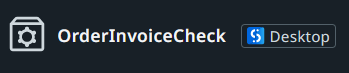
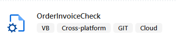
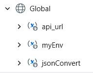
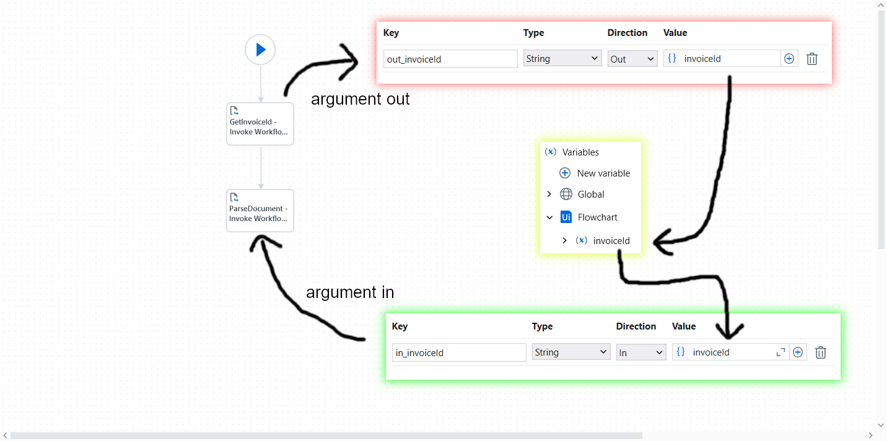
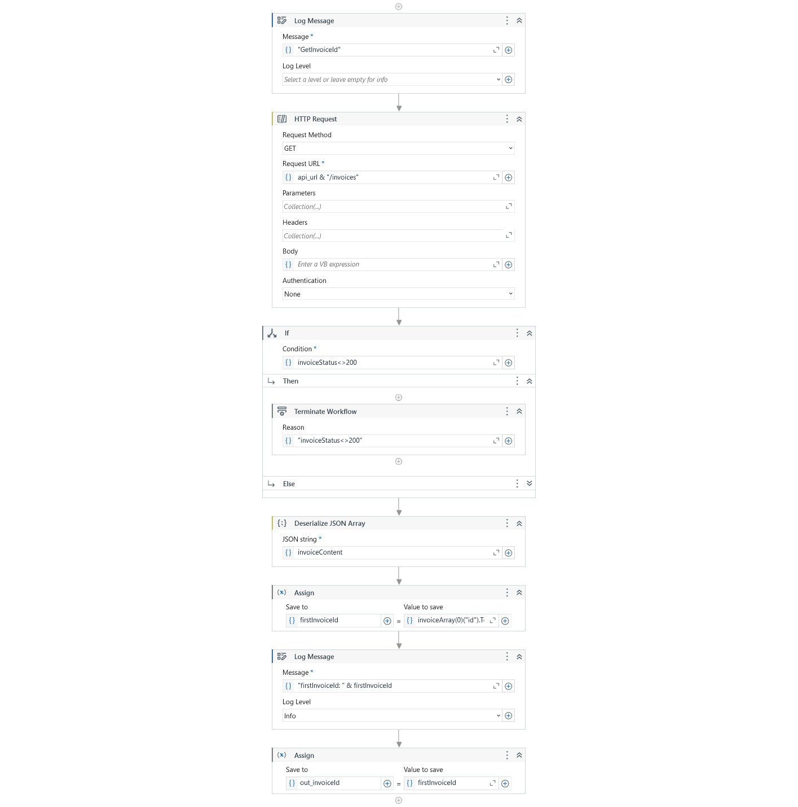
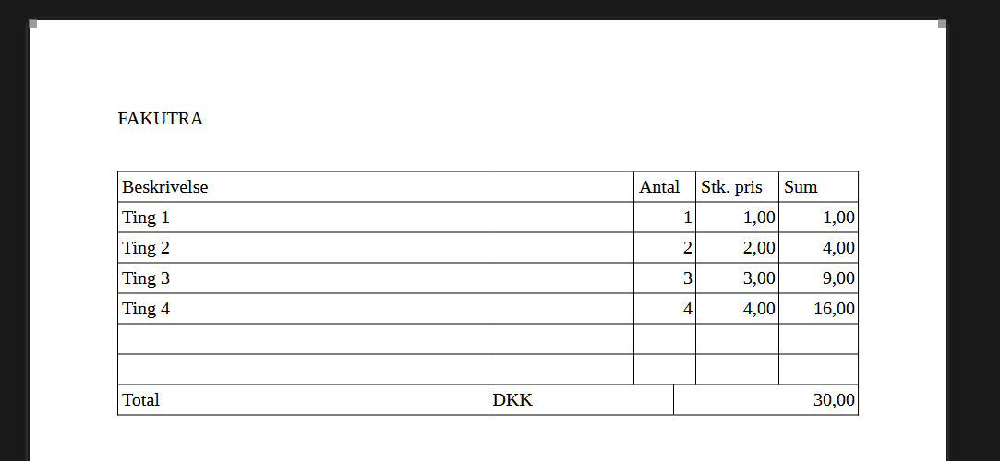
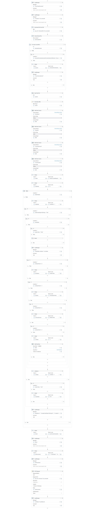

 

<h3 align="center">Unattended UiPath Robot documentation</h3>

## Project setup

When I started working on the UiPath process, I started it in the web version of UiPath Studio. However I would later discover that certain features are missing in the web version, so I transitioned to the desktop version. 

||
|:-:|
|*The process as seen in the web version, showing it has changed to desktop.*|

 

||
|:-:|
|*The process as seen in the desktop version.*|

In the screenshot of the desktop version, you can tell that this process is built for unattended Linux robots based on the tags `Cross-platform` and `Cloud`.

## Main.xml

My start Sequence is `Main.xml`, which performs some log sanity checks and allows the developer to set the targeted environment (development or production) which changes the target IP address of the backend API server.

||
|:-:|
|*Main.xml*|

Because I would be testing the development environment locally on my PC, I would need to make it use the public URL of the backend API server. When this process is actually deployed on the server, it could but it's not necessary to use the public URL, but instead communicate to the backend API using the local Docker network address (local Docker network setup explained in the backend README).

These would be stored as global variables. (`jsonConvert` is used later in the `ParseDocument.xml` sequence.)

||
|:-:|
|*Screenshot of global variables.*|

## Flowchart.xaml

The final action of `Main.xml` is to use `Invoke Workflow File` on `Flowchart.xml`. 

||
|:-:|
|*Flowchart.xml with diagrams depicting use of arguments.*|

The flowchart is very simple. Here it is being used to divide the responsiblities of the next two Sequences, to make it more maintainable and modular. Arguments are also used to pass information from one sequence to the other.

The first sequence "GetInvoiceId" outputs an argument to the flowchart, which is visible in red.

This argument is then stored as a variable in the flowchart (yellow).

Which is finally used as an input argument for the second sequence "ParseDocument" (green).

## GetInvoiceId Sequence

This sequence's job is to call the backend API and get the ID of the latest Invoice that was submitted.

||
|:-:|
|*GetInvoiceId.xml*|

It simply calls the API using a GET `HTTP Request`, using a string concatenation of `api_url` (the global variable determining the address) and "/invoices".

This returns a JSON array of Invoice objects. From which the Sequence chooses the first Invoice in the array.

The ID of that Invoice is then returned as an output argument.

## ParseDocument.xml

This sequence's job is to call the backend API to get the file associated with the InvoiceId from before, and parse it. Afterwards the parsed data is sent back to the backend API. 

Originally, it was planned to use OCR to gather data from the document, however OCR is not available for Cross-platform UiPath robots, so instead a simpler approach was taken. Instead of using OCR or an external OCR service, the Word document would be parsed manually as it is simply an XML file, and UiPath contains XML parsing activities.

||
|:-:|
|*Screenshot of the Word document Invoice*|

 

||
|:-:|
|*ParseDocument.xml*|

It is quite complicated, but these are the basic steps of what is happening:

1. Download the file from the backend API using the InvoiceId.

2. Extract the file (.docx and any other XML based document can simply be unzipped like a zip file) and locate the `document.xml` file. Save it to an ILocalResource variable.

3. Read the `document.xml` file and deserialize the XML to a Linq.XDocument variable.

4. Prepare the DataTable by adding the data columns "ItemName", "Quantity", "CurrencyAmount" and "CurrencyCode".

5. Prepare XML reading by creating a XMLReader variable and readIndex counter.

6. Start the reading while loop by using the While activity on `reader.Read()`. In every loop, add +1 to readIndex.

7. Look for nodes with NodeType "Text". These contain the data we are looking for.

8. Once we come across a Node with `reader.Value = "Sum", then we know that we are inside the data table. This is kind of a very hacky solution.

9. While we are inside the table, use a colIndex variable to track which column we are encountering such as with `If` activities on conditions like `colIndex Mod 4 = 1` to read the value to the quantity variable.

10. Once we hit `colIndex Mod 4 = 3`, we know we have encountered the last column, and so we reset colIndex to -1, and add a data row into the DataTable using four variables for each of the four columns.

11. Keep checking if we come across `reader.Value = "Total"` which would signal that we are done with the data portion of the document's table, and so we should break the While loop from step 6.

12. The DataTable is serialized to JSON using `jsonConvert.SerializeObject(table)`; the `jsonConvert` global variable being of type Newtonsoft.Json.JsonConvert.

13. Finally the serialized DataTable is sent as the Body of the PUT `HTTP Request` activity with a Content-Type `application/json` header.

## Closing remarks

While this UiPath process is probably not a very realistic example of how something would actually be automated, it does demonstrate the use of UiPath process activities, and allowed for the demonstration of the use of an unattended UiPath robot running on own premises in a containerized environment without having to spend any extra money.